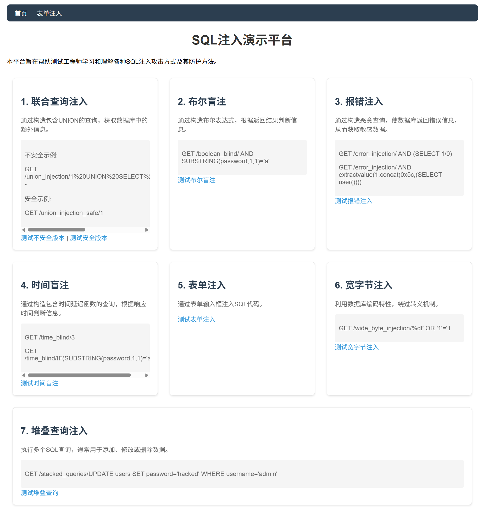

# SQL注入演示平台

## 项目介绍

本项目旨在帮助测试工程师学习和理解各种SQL注入攻击方式及其防护方法。通过FastAPI和MySQL构建，提供了多种常见SQL注入类型的演示，包括联合查询注入、布尔盲注、报错注入、时间盲注等。

## 安装与配置

### 1. 安装依赖

使用pip安装项目依赖：

```bash
pip install .
```

或者，以开发模式安装：

```bash
pip install -e .
```

### 2. 配置MySQL数据库

1. 确保已安装MySQL数据库
2. 创建数据库 `sqli_demo`
3. 修改 `config.yaml` 中的数据库连接配置：

```yaml
# 修改为你的MySQL配置
database:
  username: root
  password: password
  host: localhost
  port: 3306
  database: sqli_demo
```

### 3. 初始化数据库

启动项目时会自动创建表并插入测试数据：
- 用户表 (users)：包含3个测试用户
- 产品表 (products)：包含3个测试产品

## 启动项目

```bash
python main.py
```

项目将运行在 http://localhost:8000

## 使用方法

访问首页 http://localhost:8000 可以看到所有可用的注入演示。



### 1. 联合查询注入

- **不安全版本**：http://localhost:8000/union_injection/1%20UNION%20SELECT%201,username,password%20FROM%20users--
- **安全版本**：http://localhost:8000/union_injection_safe/1

### 2. 布尔盲注

- 示例：http://localhost:8000/boolean_blind/ AND SUBSTRING(password,1,1)='a'

### 3. 报错注入

- 示例1：http://localhost:8000/error_injection/ AND (SELECT 1/0)
- 示例2：http://localhost:8000/error_injection/ AND extractvalue(1,concat(0x5c,(SELECT user())))

### 4. 时间盲注

- 示例1：http://localhost:8000/time_blind/3
- 示例2：http://localhost:8000/time_blind/IF(SUBSTRING(password,1,1)='a',3,0)

### 5. 表单注入

访问 http://localhost:8000/form_injection 页面，尝试以下注入：
- `' OR '1'='1`
- `' UNION SELECT 1,username,password,email FROM users--`
- `' AND extractvalue(1,concat(0x5c,(SELECT user())))--`

### 6. 宽字节注入

- 示例：http://localhost:8000/wide_byte_injection/%df' OR '1'='1

### 7. 堆叠查询注入

- 示例：http://localhost:8000/stacked_queries/SELECT 1

## 安全注意事项

1. 本项目仅用于学习和教学目的，请勿在生产环境中使用
2. 测试完成后，请立即关闭服务并删除测试数据库
3. 在实际开发中，应始终使用参数化查询和ORM框架来防止SQL注入
4. 定期更新和修补数据库和应用程序漏洞

## 防护措施

1. **使用参数化查询**：始终使用参数化查询或ORM框架，避免直接拼接SQL语句
2. **输入验证**：对所有用户输入进行严格验证和过滤
3. **最小权限原则**：数据库用户应只拥有必要的权限
4. **错误处理**：避免在错误信息中暴露敏感的数据库信息
5. **使用ORM框架**：如SQLAlchemy，可以自动防止SQL注入

## 参考资料

- [Web安全学习笔记 - SQL注入检测](https://websec.readthedocs.io/zh/latest/vuln/sql/fuzz.html)